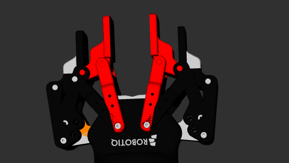

## 1. 오늘의 목표: Gazebo는 일단 미루고 MoveIt2부터!

너무 아쉽다... 오늘은 그래도 50%는 완성할 수 있을 줄 알았는데 갈 길이 너무 먼 것 같다. 
한 번에 Gazebo와 MoveIt2를 모두 연결하는 건 현재 환경에서 태스크가 너무 과하다는 판단이 들었다. 그래서 오늘은 조금 더 난이도가 높다고 생각되는 **MoveIt2 연결**을 최우선 목표로 잡고 진행했다.

### 환경 재정비 (Clean Build)
기존에 발생하던 원인 모를 Gazebo 실행 문제를 해결하기 위해, 아예 **Conda 가상환경**을 새로 팠다. 
1. `ros2`, `gazebo`, `ur_description`을 순차적으로 다시 설치.
2. 기존에 작성했던 URDF를 기반으로 SRDF와 YAML 설정 파일 생성.
3. 전용 Launch 파일을 작성하여 구동 테스트 진행.

---

## 2. 발생한 문제: 빨갛게 불타오르는 그리퍼 (Collision Error)

기대감을 안고 실행했으나, 역시나 한 번에 될 리가 없었다. ㅠㅠ 쌰갈... 
URDF가 문제인지 SRDF가 꼬인 건지, Robotiq 그리퍼의 일부가 빨간색으로 표시되면서 **Motion Planning이 실패**하는 현상이 발생했다.

### 원인 분석 및 해결 시도
빨갛게 뜨는 이유는 명확했다. 링크 간의 **Collision(충돌)** 설정이 제대로 안 된 것. 
SRDF에서 충돌 무시(`disable_collisions`) 설정을 다시 잡아줘야 했다. SRDF xacro 파일을 열어 인접 링크 간의 관계를 다시 정의하고 Rviz를 돌려보았다.

오! 한쪽 그리퍼의 충돌이 잦아드는 것을 확인했다. "이거다!" 싶어 나머지 부분도 동일하게 충돌 무시 설정을 진행했는데...

---

## 3. 새로운 복병: TF 오류와 부품 이탈

결과적으로 충돌은 해결되었지만, 예상치 못한 부작용이 터졌다.

SRDF를 건드렸더니 **TF(Transform) 명시 부분**이 꼬였는지, 그리퍼 링크가 제멋대로 움직이기 시작했다. 충돌에서 벗어났더니 이번엔 기구학적으로 로봇이 분해되는 상황. 

부랴부랴 TF를 다시 조정하고 실행해 본 결과...

우와! 부품만 덩그러니 떼졌다. 쌰깔! ㅠㅠ 
이 시점이 이미 밤 8시를 넘어가고 있었고, 그 와중에 자율주행 프로젝트 실험까지 다녀와야 해서 멘탈이 너덜너덜해졌다.

---

## 4. 결론 및 향후 계획

- **현재 진행률**: SRDF를 통한 충돌 해결 완료, 하지만 TF 매핑 오류 발생.
- **다음 목표**: 유럽 여행 가기 전까지 URDF와 MoveIt2의 완벽한 데이터 흐름(TF 및 Planning) 완성하기.

오늘은 여기까지로 만족해야겠다. 내일은 제발 부품들이 다 붙어있어 주길...
