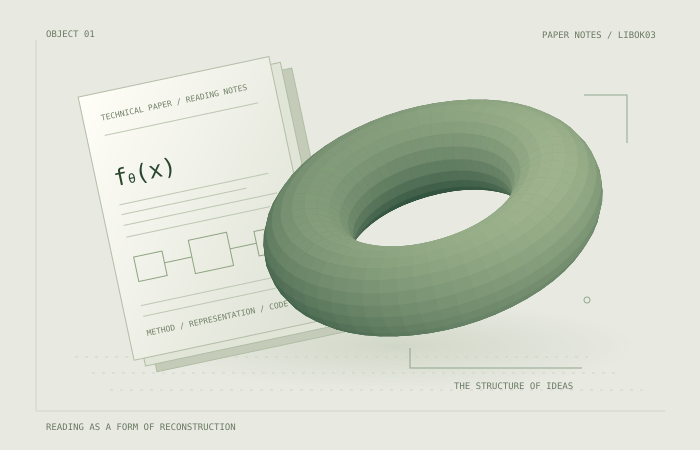

```{=html}
<section class="research-hero awards-hero" aria-labelledby="hero-title"><div class="hero-rail"><span>LIBOK03 / INDEPENDENT RESEARCH ARCHIVE</span><span>READ. DECODE. BUILD.</span></div><h1 id="hero-title" class="hero-wordmark"><span>PAPER</span><em>NOTES<span class="wordmark-dot">.</span></em></h1><div class="hero-bottom"><div class="hero-copy"><p class="hero-kicker">논문의 아이디어를,<br>구현의 언어로 기록합니다.</p><p class="hero-description">문제 정의에서 내부 로직까지.<br>수식, 데이터 흐름, 코드로 이어지는<br>연구자와 개발자를 위한 리뷰 아카이브.</p><div class="hero-actions"><a class="research-button" href="#archive-heading">아카이브 탐색 <span aria-hidden="true">↗</span></a><a class="quiet-link" href="about.html">About the notes →</a></div><p class="hero-footnote">A PERSONAL COLLECTION OF TECHNICAL UNDERSTANDING.</p></div><figure class="hero-art"><figcaption><span>OBJECT 01 / THE STRUCTURE OF IDEAS</span><span>CONCEPTUAL ARTWORK</span></figcaption></figure></div><a class="hero-scroll" href="#archive-heading" aria-label="논문 아카이브로 이동"><span>SCROLL TO THE NOTES</span><span aria-hidden="true">↓</span></a></section>
<section class="research-topics" aria-label="관심 연구 분야"><span class="topic-label">RESEARCH INTERESTS</span><span>Autonomous Driving</span><span>Robotics</span><span>Reinforcement Learning</span></section>
<section class="archive-heading" id="archive-heading"><div><p class="research-eyebrow">01 / THE READING ARCHIVE</p><h2>논문을 따라가는 기록</h2><p>핵심 아이디어, 모듈별 연산, 구현상의 선택을 연결합니다.</p></div><label class="archive-search"><span aria-hidden="true">⌕</span><input id="paper-search" type="search" placeholder="제목이나 주제로 찾기" aria-label="논문 리뷰 검색"></label></section>
```

::: {#paper-archive}
:::

```{=html}
<p id="paper-search-empty" hidden class="archive-empty">검색어와 일치하는 리뷰가 없습니다.</p>
<section class="reading-principles" aria-labelledby="principles-title"><div class="principles-intro"><p class="research-eyebrow">02 / HOW I READ</p><h2 id="principles-title">하나의 논문을<br>세 가지 관점으로.</h2></div><div class="principle"><span>01</span><h3>문제를 정의하기</h3><p>무엇을 입력받고 무엇을 예측하는가.<br>가정과 표현부터 명확하게 짚습니다.</p></div><div class="principle"><span>02</span><h3>연산을 따라가기</h3><p>모듈 사이의 데이터 흐름과 수식을<br>코드의 계산 순서에 연결합니다.</p></div><div class="principle"><span>03</span><h3>근거를 확인하기</h3><p>실험과 ablation을 읽고,<br>확인한 사실과 해석을 구분합니다.</p></div></section><div class="research-colophon"><span>RESEARCH IS A PROCESS OF UNDERSTANDING.</span><span>Notes by libok03 ↗</span></div>
```
