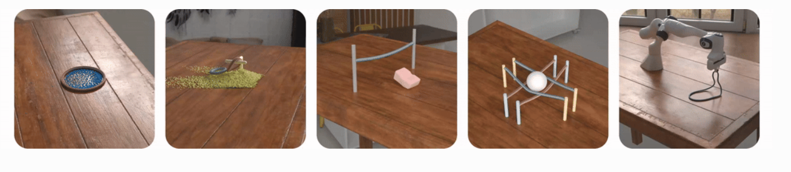
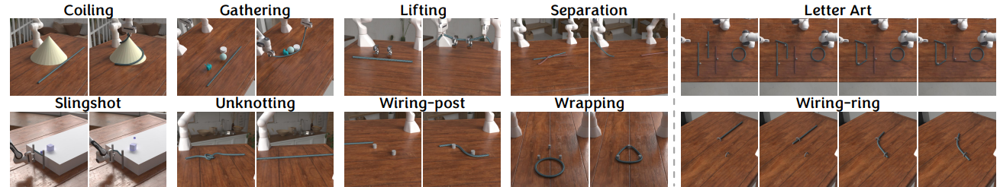
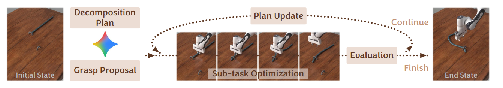
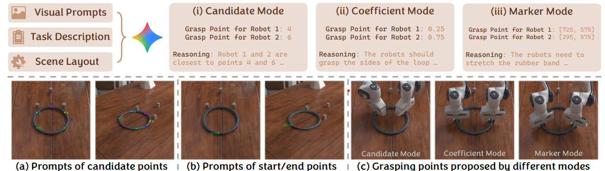

<!-- 인용을 추가할 때 references.bib에 BibTeX를 넣고 위 YAML에 bibliography: references.bib를 추가하세요. -->
    
## 이 논문을 읽는 이유

기존에 Robot Manipulation 분야에 관심을 가지고 관련 연구들을 살펴보면서, 특히 Dexterous Manipulation을 다룬 논문들을 많이 접했다. 최근에는 Force/Torque 센서, Tactile Sensor 및 학습 기반 제어 기법의 발전으로 로봇이 접촉 상태를 인지하고 정교한 조작을 수행하는 논문들이 많이 나오는거 같다.

하지만 이러한 발전에도 불구하고, **Deformable Object Manipulation**은 여전히 어려운 연구 문제로 남아 있다.

Rigid Object는 외력이 작용하더라도 형상이 일정하게 유지된다고 가정할 수 있지만, Deformable Object는 외력에 따라 형상이 지속적으로 변한다. 따라서 이러한 물체를 조작하기 위해서는 단순히 End-Effector의 목표 위치를 결정하는 것을 넘어, 물체의 기계적 특성과 환경과의 상호작용까지 고려해야 한다.

이러한 문제에 관심을 가지고 관련 논문을 찾아보던 중, **DLO-Lab: Benchmarking Deformable Linear Object Manipulations with Differentiable Physics**를 읽게 되었다.

## 논문과 구현 정보

| 항목 | 내용 |
|---|---|
| 논문 | DLO-Lab: Benchmarking Deformable Linear Object Manipulations with Differentiable Physics |
| 저자 | Junyi Cao, Yian Wang, Ziyan Xiong, Chunru Lin, Zhehuan Chen, Chuang Gan |
| 학회 | ICML 2026 |
| 원문 | [arXiv:2606.04206](https://arxiv.org/abs/2606.04206) |
| 공식 코드 | [DLO-Lab GitHub](https://github.com/UMass-Embodied-AGI/DLO-Lab) |
| 프로젝트 페이지 | [DLO-Lab](https://dlo-lab-26.github.io/) |
| 핵심 기여 | Differentiable Physics Simulator, DLO Manipulation Benchmark, Long-Horizon DLO Agent |

## 논문의 주요 구성

이 논문은 크게 세 가지로 나눌 수 있다.

### 1. Differentiable Physics Simulator

Discrete Elastic Rod(DER)를 기반으로 로프, 케이블, 철사와 같은 선형 변형체의 물리적 특성을 모델링한다.

기존 Rigid Body와 달리 DLO는 외력에 의해 형상이 연속적으로 변하기 때문에 Stretching, Bending, Twisting과 같은 변형을 고려해야 한다.

이 논문에서는 Discrete Elastic Rod(DER)를 사용한다. 로프의 중심선을 여러 Vertex로 나누어 표현하며, 각 Vertex의 위치는 다음과 같다.

$$
\mathbf{x}_i \in \mathbb{R}^3
$$

인접한 두 Vertex를 연결하는 Edge는 다음과 같이 정의한다.

$$
\mathbf{e}^j = \mathbf{x}_{j+1} - \mathbf{x}_j
$$

#### Stretching

일반적인 스프링의 탄성 에너지는 다음과 같이 표현한다.

$$
U = \frac{1}{2}k(\Delta x)^2
$$

DER에서도 이와 유사하게 각 Edge의 원래 길이와 현재 길이의 차이를 이용해 탄성 에너지를 계산한다.

먼저 Stretching Strain은 다음과 같다.

$$
\epsilon^j = \frac{|\mathbf{e}^j|}{|\bar{\mathbf{e}}^j|}-1
$$

여기서 $|\bar{\mathbf{e}}^j|$는 변형 전 Edge의 길이이고, $|\mathbf{e}^j|$는 현재 길이다.

이를 이용한 Stretching Energy는 다음과 같다.

$$
U_s = \frac{1}{2}\sum_{j=1}^{N_e}k_s^j(\epsilon^j)^2|\bar{\mathbf{e}}^j|
$$

여기서 $k_s^j=KA^j$이며, $K$는 Stretching Modulus, $A^j$는 단면적이다.

#### Bending

Bending도 앞부분의 Stretching과 마찬가지로 Energy 기반으로 설명한다.

논문에서는 인접한 두 Edge의 단위 접선벡터를 이용해 Curvature Binormal을 계산한다.

$$
\mathbf{t}^i = \frac{\mathbf{e}^i}{|\mathbf{e}^i|}
$$

$$
(\kappa\mathbf{b})_i =
\frac{2\mathbf{t}^{i-1}\times\mathbf{t}^i}
{1+\mathbf{t}^{i-1}\cdot\mathbf{t}^i}
$$

이렇게 계산한 Curvature Binormal을 Material Frame에 투영하여 Curvature $\boldsymbol{\kappa}_i$를 구한다.

이후 현재 Curvature와 Rest Curvature의 차이를 이용해 Bending Energy를 계산한다.

$$
U_b =
\frac{1}{2}
\sum_{i=2}^{N_v-1}
\frac{1}{\bar{l}_i}
(\boldsymbol{\kappa}_i-\bar{\boldsymbol{\kappa}}_i)^T
\mathbf{B}_i
(\boldsymbol{\kappa}_i-\bar{\boldsymbol{\kappa}}_i)
$$

여기서

- $\boldsymbol{\kappa}_i$: 현재 Curvature
- $\bar{\boldsymbol{\kappa}}_i$: Rest Curvature
- $\mathbf{B}_i$: Bending Stiffness Matrix
- $\bar{l}_i$: Vertex의 Rest Voronoi Length

이다.

#### Twisting

Stretching과 Bending에 이어서, 이번에는 로프의 중심선을 기준으로 단면이 회전하는 Twisting을 고려한다.

Twisting Strain은 현재 Twist와 Rest Twist의 차이로 정의한다.

$$
\tau_i=m_i-\bar{m}_i
$$

여기서 $m_i$는 현재 Twist, $\bar{m}_i$는 변형 전 Twist다.

Twisting Energy는 다음과 같다.

$$
U_t =
\frac{1}{2}
\sum_{i=2}^{N_v-1}
\frac{\beta_i\tau_i^2}{\bar{l}_i}
$$

여기서 $\beta_i$는 Torsional Stiffness이며, 원형 단면에 대해 다음과 같이 정의된다.

$$
\beta_i=\frac{GA_i r_i^2}{2}
$$

$G$는 Shear Modulus, $A_i$는 단면적, $r_i$는 반지름이다.

결국 전체 Elastic Potential Energy는 다음과 같다.

$$
\boxed{U=U_s+U_b+U_t}
$$

#### Plastic Deformation

지금까지 설명한 내용은 모두 탄성 변형을 기반으로 한다. 즉, 외력을 제거하면 원래 형상으로 복원되는 것을 가정한다.

하지만 철사와 같은 탄소성(Elastoplastic) 재료는 일정 수준 이상으로 굽히면 외력을 제거하더라도 원래 형상으로 완전히 돌아오지 않는다.

이 논문에서는 이러한 영구 변형을 표현하기 위해 Bending Plasticity를 추가했다.

이를 위해 각 Vertex의 Rest Curvature를 관리한다.

$$
\bar{\boldsymbol{\kappa}}_i
$$

현재 Curvature와 Rest Curvature의 차이인 Elastic Curvature는 다음과 같다.

$$
\boldsymbol{\kappa}_i^{el}
=
\boldsymbol{\kappa}_i-\bar{\boldsymbol{\kappa}}_i
$$

그리고 Elastic Curvature의 크기가 Yield Threshold를 초과하면 Plastic Deformation이 발생한다고 판단한다.

$$
|\boldsymbol{\kappa}_i^{el}|>\sigma_y
$$

이때 Rest Curvature를 다음과 같이 갱신한다.

$$
\Delta\bar{\boldsymbol{\kappa}}_i
=
r_c
\frac{|\boldsymbol{\kappa}_i^{el}|-\sigma_y}
{|\boldsymbol{\kappa}_i^{el}|}
\boldsymbol{\kappa}_i^{el}
$$

여기서

- $\sigma_y$: Yield Threshold
- $r_c$: Plastic Creep Rate

이다.

최종적으로 Rest Curvature는 다음과 같이 업데이트된다.

$$
\bar{\boldsymbol{\kappa}}_i^{t+1}
=
\bar{\boldsymbol{\kappa}}_i^t+
\Delta\bar{\boldsymbol{\kappa}}_i
$$

즉, 일정 수준 이상으로 굽혀진 경우 Rest Curvature 자체를 변경하여 외력을 제거한 이후에도 변형된 형상이 유지되도록 한다.

근데 이러면 에너지만 계산할수 있지 그래서 어떤 속도로, 어떤 방향으로 이동하고 시뮬에서는 어케 나타내는데? 라고 생각할수 있다. 찾아보니까 이 논문에서는 앞서 계산한 Potential Energy를 각 Vertex의 위치에 대해 편미분해서 힘을 구하고, 이를 뉴턴의 운동 법칙에 적용하여 물체의 움직임을 계산한다.

먼저 Potential Energy와 Force의 관계는 다음과 같다.

$$
\mathbf{F}_i=-\frac{\partial U}{\partial \mathbf{x}_i}
$$

즉, 각 Vertex에 작용하는 힘의 크기와 방향을 구할 수 있다. 이후 뉴턴의 운동 법칙인 $F=ma$를 이용하면 각 Vertex의 가속도를 계산할 수 있다.

이렇게 계산한 가속도를 바탕으로 Symplectic Euler Integration을 이용해 다음 시점의 속도와 위치를 갱신한다.

$$
\mathbf{v}_i^{t+1}=\mathbf{v}_i^t+\Delta t\mathbf{a}_i^t
$$

$$
\mathbf{x}_i^{t+1}=\mathbf{x}_i^t+\Delta t\mathbf{v}_i^{t+1}
$$

여기서 $\Delta t$는 시뮬레이션의 시간 간격이다. 위 식은 감쇠와 충돌 보정을 생략한 기본적인 형태이며, 실제 구현에서는 중력과 Damping도 고려한다.

그런데 이런 방식으로 위치를 갱신하기만 하면 로프가 다른 물체를 관통하거나, 길이가 일정해야 하는 로프가 비정상적으로 늘어나는 문제가 발생할 수 있다.

이를 해결하기 위해 **Position-Based Dynamics(PBD)**를 사용한다. PBD는 물체의 위치가 특정 제약조건을 위반했을 때, 해당 위치를 직접 보정하는 방식이다.

DLO-Lab에서는 이러한 방법으로 로프의 길이 제약과 충돌을 처리하고, 보정된 위치를 이용해 속도를 다시 계산한 뒤 마찰까지 반영한다.

결과적으로 DLO-Lab은 Potential Energy 계산 → Force 계산 → 속도 및 위치 갱신 → 충돌 및 제약조건 보정 과정을 반복하면서 로프의 움직임을 시뮬레이션한다.

또한 Automatic Differentiation을 지원하여 시뮬레이션 과정에서 Gradient를 계산할 수 있도록 하며, 이를 Trajectory Optimization 및 학습에 활용할 수 있다.

논문에서는 이를 위해 기존 Genesis Physics Engine에 DLO를 위한 Solver를 추가했다.

즉, 앞서 설명한 DER 기반 동역학 계산을 Genesis 내부에서 수행하고, 계산된 Vertex의 위치와 Material Frame을 바탕으로 로프의 형상을 업데이트한다.

### 2. DLO Manipulation Benchmark

다양한 DLO Manipulation 알고리즘의 성능을 비교하기 위한 Benchmark를 구축한다.

총 10개의 Manipulation Task로 구성되며, 8개의 Fixed-Horizon Task와 2개의 Long-Horizon Task를 포함한다.

함 각각 보자
## DLO Manipulation Benchmark

### Fixed-Horizon Tasks

#### 1. Coiling

**목표:** 고정된 원뿔(Cone)의 표면에 로프를 감는 작업.

**평가 요소:** 로프가 원뿔의 곡면을 따라 휘어지고 접촉을 유지하는지.

**Reward:**

$$
R_0=-\sum_i\|\mathbf{x}_i-\mathbf{c}_{cone}\|
$$

실제 구현에서는 지수변환을 적용한다.

$$
R=\exp(0.1R_0)
$$

각 Vertex가 원뿔의 중심에 가까워질수록 Reward가 증가한다.

#### 2. Gathering

**목표:** 바닥에 흩어진 세 개의 물체를 로프를 이용해 한곳으로 모으는 작업.

**평가 요소:** 로프와 물체 사이의 접촉, 마찰을 통한 힘 전달, 물체 사이의 거리.

**Reward:**

$$
R=\exp(R_{\text{cluster}}+R_{\text{contact}}-P_{\text{EF}})
$$

여기서

$$
R_{\text{cluster}}
=-\sum_{a<b}\|\mathbf{p}_a-\mathbf{p}_b\|
$$

$$
R_{\text{contact}}
=-0.1\sum_o\min_i\|\mathbf{x}_i-\mathbf{p}_o\|
$$

$$
P_{\text{EF}}
=100\sum_k\max\left(0,\;0.1-\min_o\|\mathbf{p}^{ef}_k-\mathbf{p}_o\|\right)
$$

이다.

즉, 물체 사이의 거리와 로프-물체 사이의 거리를 최소화하면서, 로봇의 End-Effector가 물체를 직접 밀지 않도록 Penalty를 부여한다.

#### 3. Lifting

**목표:** 로프를 이용하여 두 개의 C자 형태 링을 들어 올리는 작업.

**평가 요소:** 로프의 장력 전달, 물체와의 접촉, 안정적인 하중 지지.

**Reward:**

$$
R=5R_{\text{height}}+R_{\text{config}}-0.5P_{\text{dist}}-100P_{\text{EF}}
$$

각 항목은 다음을 의미한다.

- $R_{\text{height}}$: 두 링의 높이 합
- $R_{\text{config}}$: 로프가 링의 중심보다 약간 높은 위치에서 지지하도록 유도하는 보상
- $P_{\text{dist}}$: 로프와 각 링 중심 사이의 최소 거리 합
- $P_{\text{EF}}$: End-Effector가 링에 직접 접근하는 행동에 대한 Penalty

로프가 실제로 링을 지지하면서 들어 올리도록 Reward를 설계했다.

#### 4. Separation

**목표:** 서로 얽혀 있는 두 개의 로프를 두 로봇 팔로 분리하는 작업.

**평가 요소:** 로프 간 Self/Mutual Contact, 얽힘 상태 해소, 로프 사이의 거리.

**Reward:**

$$
R=D_{\text{Chamfer}}(A,B)
$$

여기서

$$
D_{\text{Chamfer}}(A,B)
=
\frac{1}{|A|}\sum_{\mathbf{a}\in A}
\min_{\mathbf{b}\in B}\|\mathbf{a}-\mathbf{b}\|
+
\frac{1}{|B|}\sum_{\mathbf{b}\in B}
\min_{\mathbf{a}\in A}\|\mathbf{b}-\mathbf{a}\|
$$

이다.

두 로프의 Chamfer Distance가 커질수록 Reward가 증가하도록 설계했다.

#### 5. Slingshot

**목표:** 로프의 탄성력을 이용하여 공을 발사하고, 앞에 놓인 큐브를 맞히는 작업.

**평가 요소:** 탄성 에너지의 저장 및 방출, 충돌, 운동량 전달.

**Reward:**

$$
R=\operatorname{clip}(y_{\text{cube}},0,5)
$$

여기서 $y_{\text{cube}}$는 발사 방향인 $+y$축에서 큐브의 위치를 의미한다.

즉, 공에 맞은 큐브가 발사 방향으로 멀리 이동할수록 Reward가 증가한다.

#### 6. Unknotting

**목표:** Overhand Knot이 형성된 로프의 매듭을 푸는 작업.

**평가 요소:** Topological Complexity, Self-Contact, 매듭의 얽힘 정도.

**Reward:**

$$
R=\exp\left[-\left(ACN+100P_{\text{repulsion}}\right)\right]
$$

여기서

- $ACN$: Average Crossing Number로, 로프의 얽힘 정도를 나타내는 값
- $P_{\text{repulsion}}$: 인접하지 않은 로프 구간이 과도하게 가까워질 때 발생하는 Penalty

이다.

매듭의 얽힘 정도를 줄이면서 로프 구간 사이의 비정상적인 교차와 밀집을 방지하도록 설계했다.

#### 7. Wiring-post

**목표:** 두 개의 고정된 기둥 사이에 로프를 S자 형태로 배치하는 작업.

**평가 요소:** 목표 형상과의 일치도, 로프 중간점 정렬, 장애물 높이 제약.

**Reward:**

$$
R=\exp\left[-\left(D_{\text{shape}}+P_{\text{mid}}+P_{\text{height}}\right)\right]
$$

여기서

$$
D_{\text{shape}}=D_{\text{Chamfer}}(X,X_{\text{goal}})
$$

$$
P_{\text{mid}}
=5\max\left(0,\|\mathbf{x}_{mid}^{xy}-\mathbf{c}^{xy}\|-0.02\right)
$$

$$
P_{\text{height}}
=\frac{1}{N}\sum_i\max(0,z_i-0.04)
$$

이다.

목표 로프 형상과의 거리를 최소화하면서, 로프의 중간점을 정렬하고 기둥 위로 지나치게 올라가지 않도록 제한한다.

#### 8. Wrapping

**목표:** 고무줄을 늘려 테이블에 고정된 세 개의 원통을 감싸는 작업.

**평가 요소:** Stretching, 장력 유지, Contact, 원통을 감싸는 Topological Winding.

**Reward:**

$$
R=R_{\text{winding}}-P_{\text{contact}}
$$

여기서

$$
R_{\text{winding}}
=1-\frac{1}{3}\sum_{j=1}^{3}(|W_j|-1)^2
$$

$$
P_{\text{contact}}
=\sum_{j=1}^{3}\max\left(0,\min_i\|\mathbf{x}_i-\mathbf{p}_j\|-0.015\right)
$$

이다.

$W_j$는 $j$번째 원통에 대한 Winding Number를 의미한다.

각 원통을 한 바퀴 감싸면 $|W_j|$가 1에 가까워지므로 Reward가 증가한다. 또한 로프가 원통 표면에 가까이 위치하도록 Contact Penalty를 적용한다.

---

### Long-Horizon Tasks

#### 9. Letter Art

**목표:** 세 개의 직선 로프를 구부려 D와 L을 만들고, 고정된 고무줄을 O로 활용하여 최종적으로 DLO라는 글자를 완성하는 작업.

**평가 요소:** Plastic Deformation, 목표 형상 제어, Grasping Point Selection, Task Decomposition.

**Reward:**

이 작업에서는 하나의 고정된 Reward를 사용하는 대신, DLO Agent가 작업을 여러 Subtask로 나누고 각 단계의 Reward Function을 생성한다.

$$
R_k=R_{\text{Agent},k}(s_t)
$$

여기서 $k$는 현재 Subtask를 의미한다. 위 식은 고정된 보상식이 아니라, 단계별로 생성되는 보상 함수를 나타내는 표기다.

각 단계에서 목표 형상을 달성한 뒤 현재 로프의 변형 상태를 평가하고, 필요에 따라 다음 작업 계획을 갱신한다.

#### 10. Wiring-ring

**목표:** 로프를 테이블에 고정된 두 개의 링에 순서대로 통과시키는 작업.

**평가 요소:** Contact, Threading, Sequential Planning, Regrasping, Dynamic Replanning.

**Reward:**

Letter Art와 마찬가지로 DLO Agent가 각 Subtask에 맞는 Reward Function을 생성한다.

$$
R_k=R_{\text{Agent},k}(s_t)
$$

첫 번째 링 통과와 두 번째 링 통과를 별개의 작업으로 분해할 수 있으며, 중간 실행 결과에 따라 다음 단계의 Reward 및 Trajectory Optimization 목표를 갱신한다.

근데 이러면 드는 생각이, 그래서 **왜 굳이 이 테스크로 나눴는지**가 될것이다. 논문에서는 그 이유를 기존 연구들이 특정 상황에 국한된 단순한 Task를 사용하는 경우가 많았던 반면, DLO-Lab에서는 실제 산업, 물류, 의료 분야에서 사용되는 조작 작업들을 고려했다고 한다.

이를 위해 실제 DLO Manipulation에서 필요한 능력을 다음과 같은 5가지 핵심 Manipulation Skill로 분류했다.

Cable Routing & Threading: Wiring-post, Wiring-ring과 같이 케이블을 특정 경로나 좁은 공간으로 통과시키는 작업이다. 산업용 배선이나 수술용 봉합 등에 활용된다.

Topological Manipulation: Unknotting, Separation과 같이 로프의 매듭이나 얽힘 구조를 변경하는 작업이다. 케이블 유지보수나 물류 작업과 관련된다.

Winding & Binding: Coiling, Wrapping과 같이 로프를 특정 물체에 감는 작업이다. 장력을 유지하면서 물체의 형상에 맞게 변형시키는 능력이 필요하다.

Precision Shape Control: Letter Art와 같이 DLO를 정확한 목표 형상으로 변형시키는 작업이다. 와이어 성형이나 카테터 형상 제어 등에 활용될 수 있다.

DLO-Mediated Manipulation: Gathering, Lifting, Slingshot과 같이 DLO 자체를 도구로 사용하여 다른 물체를 움직이는 작업이다. 로프의 장력이나 탄성력을 이용해 물체에 힘을 전달한다.

즉, 단순히 로프를 움직이는 능력만 평가하는 것이 아니라, 서로 다른 물리적 상호작용과 실제 조작 능력을 포괄하도록 Benchmark를 구성한 것이다.

### 3. Long-Horizon DLO Agent

Long-Horizon Manipulation에서는 단일 동작만으로 목표를 달성하기 어렵기 때문에 여러 단계의 작업을 순차적으로 수행해야 한다.

특히 DLO는 이전 단계의 조작 결과에 따라 물체의 형상과 접촉 상태가 변하기 때문에, 이후의 Grasping Point와 조작 경로를 다시 결정해야 할 수 있다.

이를 해결하기 위해 논문에서는 **VLM을 활용한 DLO Agent**를 제안한다.

DLO Agent는 크게 **Grasp Proposal**과 **Task Decomposition**이라는 두 가지 역할을 수행한다.

#### Grasp Proposal

DLO Manipulation에서는 로프의 어느 위치를 잡느냐에 따라 조작 결과가 크게 달라진다.

예를 들어 Unknotting에서는 잘못된 위치를 잡으면 로봇이 아무리 움직이더라도 매듭을 풀기 어려울 수 있다.

따라서 논문에서는 VLM이 **Visual Prompts, Task Description, Scene Layout**을 입력받아 적절한 Grasping Point를 선정하도록 했다.

여기서 저자들은 Grasping Point를 선정하는 방법을 세 가지로 구분해 비교한다.

**1. Candidate Mode**

DLO를 따라 일정한 간격으로 Grasping Point 후보를 생성하고, 각 후보에 번호를 부여한다.

VLM은 주어진 작업과 로봇의 위치를 고려하여 후보 중 적절한 위치를 선택한다.

**2. Coefficient Mode**

DLO의 시작점과 끝점을 기준으로 전체 길이를 0~1 범위로 정규화한다.

VLM은 해당 범위의 실숫값을 출력하여 Grasping Point의 상대적인 위치를 결정한다.

Candidate Mode와 달리 미리 정해진 후보에 제한되지 않고, DLO의 길이를 따라 연속적인 위치를 표현할 수 있다.

**3. Marker Mode**

VLM이 Rendering Image에서 Grasping Point의 2D Pixel Coordinate를 직접 예측하는 방식이다.
이후 예측된 위치를 실제 DLO의 Vertex에 대응시켜 Grasping Point를 결정한다.

이 방법은 이미지에서 위치를 직접 지정할 수 있지만, Pixel Coordinate의 예측 오차가 실제 Grasping Point의 오차로 이어질 수 있다.

#### Task Decomposition

적절한 Grasping Point를 선정하는 것만으로 Long-Horizon Manipulation을 해결할 수는 없다.

예를 들어 Wiring-ring에서는 첫 번째 링을 통과시킨 이후 로프의 변형된 상태를 고려하여 두 번째 링을 통과시켜야 한다.

이러한 작업을 하나의 긴 Trajectory로 최적화하려면 탐색 공간이 커지고, 고정된 Reward Function만으로는 중간 단계의 목표를 충분히 표현하기 어려울 수 있다.

따라서 논문에서는 VLM이 전체 작업을 여러 **Subtask로 분해하는 Task Decomposition**을 사용한다.

먼저 VLM은 Task Description을 바탕으로 초기 계획을 생성한다. 이때 Grasping Point를 변경해야 하는 시점을 고려하여 작업을 나누고, 각 Subtask에 대해 다음 정보를 정의한다.

- **Reward Function:** 해당 단계에서 달성해야 할 목표를 평가하는 함수
- **Horizon Length:** 해당 단계의 Trajectory Optimization에 사용할 Action Step 수
- **Completion Criteria:** 전체 작업이 완료되었는지 판단하는 기준

이후 앞서 설명한 Grasp Proposal을 통해 적절한 Grasping Point를 선정하고, 각 Subtask에 대해 **CMA-ES 기반 Trajectory Optimization**을 순차적으로 수행한다.

그런데 여기서 한 가지 문제가 발생한다.

DLO는 조작 과정에서 형상이 계속 변하기 때문에, 처음에 생성한 계획이 이후 단계에서도 유효하다고 보장할 수 없다는 것이다.

이를 해결하기 위해 논문에서는 **Dynamic Plan Update**를 적용한다.

각 Subtask의 Trajectory Optimization이 끝나면, 최적화된 Trajectory의 Rendering 결과를 VLM에 전달한다.

VLM은 현재 작업의 완료 여부를 판단하고, 전체 목표가 달성되지 않았다면 변경된 DLO 상태에 맞게 이후 Subtask의 계획을 수정한다.

필요한 경우 Reward Function과 Horizon을 다시 정의하거나 Subtask를 추가로 분해할 수도 있다.

따라서 전체 과정은 다음과 같이 정리할 수 있다.

1. **Task Decomposition:** VLM이 전체 작업을 여러 Subtask로 분해한다.
2. **Grasp Proposal:** 각 단계에서 적절한 Grasping Point를 선정한다.
3. **Trajectory Optimization:** CMA-ES를 이용해 해당 Subtask의 조작 경로를 최적화한다.
4. **Evaluation:** 최적화된 Trajectory의 결과를 VLM이 평가한다.
5. **Plan Update:** 목표가 완료되지 않았다면 이후 Subtask의 계획을 수정하고 과정을 반복한다.

즉, DLO Agent는 로봇의 Low-Level Action을 직접 예측하는 것이 아니라, **어디를 잡을지, 어떤 순서로 작업할지, 각 단계에서 무엇을 최적화할지를 결정하는 High-Level Planner** 역할을 수행한다.

결과적으로 논문에서는 VLM을 이용한 고수준 계획과 물리 시뮬레이션 기반 Trajectory Optimization을 결합하여, DLO의 형상 변화에 따라 조작 계획을 수정할 수 있는 Long-Horizon Manipulation 구조를 제안한 것이다.

그럼이제 사람들은 왜 **굳이굳이 CMA-ES를 사용해서 경로를 최적화한거지?** 라고 생각할것이다. 

먼저 CMA-ES(Covariance Matrix Adaptation Evolution Strategy)는 Gradient를 사용하지 않는 Sampling-Based Optimization Algorithm이다.

Gradient Descent가 현재 위치에서 Loss의 기울기를 계산하고 이를 따라 최적화하는 방식이라면, CMA-ES는 여러 개의 Trajectory 후보를 생성하고, 실제 시뮬레이션에서 얻은 Reward를 바탕으로 다음 후보를 생성할 확률분포를 갱신한다.

일반적으로 후보 해는 다음과 같은 다변량 정규분포에서 Sampling한다.

$$
\mathbf{z}_k \sim \mathcal{N}(\boldsymbol{\mu},\sigma^2\mathbf{C})
$$

여기서 $\mathbf{z}_k$는 최적화할 Trajectory Parameter, $\boldsymbol{\mu}$는 분포의 평균, $\mathbf{C}$는 공분산 행렬, $\sigma$는 전체 탐색 범위를 조절하는 값이다.

각 후보 Trajectory를 시뮬레이션한 뒤 성능이 우수한 후보들을 기준으로 평균과 공분산을 갱신하고, 이 과정을 반복하여 Reward가 높은 Trajectory를 찾는다.

그렇다면 왜 이러한 Sampling 방식이 DLO Manipulation에서 유리할까?

논문에서는 크게 두 가지 이유를 설명한다.

첫 번째는 Gradient Inaccessibility 문제다.

예를 들어 Slingshot에서는 로프의 탄성력으로 공을 발사하고, 공이 큐브에 충돌해야 Reward가 발생한다.

그런데 아직 공이 큐브에 닿지 않았다면 로봇의 Action을 조금 변경하더라도 큐브의 위치는 변하지 않을 수 있다.

이러한 상황에서는 최종 Reward를 Action에 대해 미분하더라도 Gradient가 0에 가깝게 나타날 수 있다.

$$
\frac{\partial R}{\partial \mathbf{a}_t}\approx 0
$$

따라서 Gradient Descent는 어떤 방향으로 Action을 수정해야 하는지 판단하기 어렵다.

반면 CMA-ES는 Gradient를 계산하지 않고 다양한 Trajectory를 직접 Sampling하기 때문에, 접촉이 발생하는 새로운 상태까지 탐색할 수 있다.

두 번째는 Non-Smooth Optimization Landscape 문제다.

DLO Manipulation에서는 로프와 물체가 접촉하거나 분리되고, Self-Collision 및 Topological Change가 발생한다.

이러한 과정에서는 Action의 작은 변화가 접촉 상태를 크게 바꾸면서 Reward가 급격히 달라질 수 있다.

따라서 Gradient가 계산되더라도 해당 Gradient가 전체적으로 좋은 Trajectory를 찾는 데 유용하다고 보장할 수 없다.

논문에서는 이러한 문제로 인해 Gradient Descent가 Local Optimum에 쉽게 수렴할 수 있다고 설명한다.

실제로 Appendix C.2의 성공률을 보면, GD는 Coiling과 Separation에서 각각 100%를 달성했지만 Gathering, Lifting, Slingshot, Unknotting에서는 0%를 기록했다.

반면 CMA-ES는 Gathering에서 100%, Lifting에서 87%, Slingshot과 Unknotting에서 각각 93%의 성공률을 보였다.

전체 8개 Benchmark의 평균 성공률 역시 GD는 25.0%, CMA-ES는 86.6%로 나타났다. 다만 두 알고리즘은 최종 Trajectory를 평가하는 방식이 다르므로 이 수치를 완전히 동일한 조건의 비교로 해석해서는 안 된다.

물론 CMA-ES에도 단점은 있다. 많은 후보 Trajectory를 시뮬레이션해야 하므로 계산 비용이 크고, 논문에서는 만족스러운 Trajectory를 얻는 데 일반적으로 1~2시간이 소요된다고 보고한다.

반대로 Coiling처럼 Reward Landscape가 비교적 Smooth하고 유용한 Gradient를 얻을 수 있는 작업에서는 Gradient Descent가 훨씬 빠르게 수렴할 수 있다.

즉, Differentiable Physics가 불필요하다는 것이 아니라, 물리 시뮬레이션이 미분 가능하더라도 그 Gradient가 모든 조작 문제에서 유용한 것은 아니라는 점이 핵심이다.

결과적으로 저자들은 Contact와 Topology 변화가 빈번한 복잡한 DLO Manipulation에서 보다 안정적으로 Trajectory를 탐색하기 위해 CMA-ES를 사용한 것이다.

## 맺음말

이 논문을 읽으면서 가장 대단하다고 느꼈던 부분은 DER를 기반으로 이 정도 수준의 물리 시뮬레이터를 구현했다는 점이었다.

물론 시뮬레이션 영상을 살펴보면 아쉬운 부분도 있었다. 특히 로프와 테이블 사이의 마찰이나, 로프가 구부러지면서 변형되는 모습이 실제 물리 현상과는 다소 다르게 느껴지는 장면들이 있었다. 이것이 Contact 및 Friction 모델의 한계인지, Bending Stiffness나 다른 물성 파라미터의 문제인지는 정확하게 알 수 없지만, 아직 개선할 여지가 있다는 생각이 들었다.

그럼에도 불구하고 로프의 Stretching, Bending, Twisting부터 Contact와 Collision까지 고려하여, 이를 실제 로봇 Manipulation에 활용할 수 있는 시뮬레이션 환경으로 구현했다는 사실 자체가 인상적이었다.

무엇보다 놀라웠던 것은 이러한 복잡한 물리 현상을 계산 가능한 형태로 모델링하고, 실제로 작동하는 시뮬레이터로 구현하기까지의 접근 방식이었다.

또 하나 인상 깊었던 부분은 Appendix였다. 본문에서 충분히 설명하지 못한 구현상의 세부 사항이나 실험 설정, 설계 근거 등을 Appendix에서 상당히 자세하게 다루고 있었다. 단순히 결과만 제시하는 것이 아니라, 왜 이러한 방법을 선택했는지 이해할 수 있도록 설명했다는 점이 좋았다.

개인적으로는 논문에서 제시한 결과뿐만 아니라, 하나의 물리적 문제를 수학적으로 모델링하고, 이를 구현하고, 실험을 통해 검증하는 전체 과정에서 배울 점이 많았던 논문이었다.